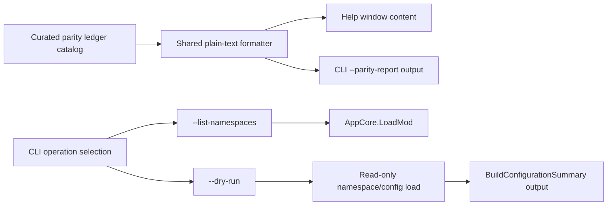

# feat: Add parity confidence ledger

## Summary

Implement a first parity-confidence slice that makes KPatcher's proof story inspectable in-product while removing an already-visible trust gap in the CLI. The work adds a shared parity ledger report for GUI and CLI, then brings the currently advertised `--list-namespaces` and `--dry-run` operations up to the level the help text already promises.

---

## Problem Frame

KPatcher's strategy and verification docs position parity as the product's core differentiator, but that proof currently lives mostly in scattered markdown and internal repo knowledge. At the same time, the CLI help advertises `--list-namespaces` and `--dry-run` even though the current runtime still routes CLI work through install/uninstall/validate-only handling and rejects those flows unless a game directory is supplied, which weakens the trust story this slice is supposed to strengthen.

---

## Assumptions

*This plan was authored without synchronous user confirmation. The items below are agent inferences that fill gaps in the input — un-validated bets that should be reviewed before implementation proceeds.*

- The `lfg` run should advance the highest-ranked recent ideation topic in `docs/ideation/2026-05-23-open-ideation.md` because no explicit task argument was provided.
- The right first slice is a trust-oriented reporting feature inside existing KPatcher desktop and CLI surfaces, not a new dashboard, workflow, or install semantic.

---

## Requirements

- R1. Users and maintainers can inspect a concise parity-confidence report from existing KPatcher surfaces without needing to read repo docs separately.
- R2. CLI help and runtime behavior stay aligned for parity-related read-only flows: `--list-namespaces` and `--dry-run` must work as documented, and the new parity report must be available from the CLI as a read-only command.
- R3. The parity-confidence content is generated from one shared, testable source so GUI and CLI do not drift.
- R4. Read-only CLI flows remain non-mutating: they must not trigger installation, backup creation, or side-effect file generation in the mod tree.
- R5. Coverage follows repo testing policy: new tests stay in C# code, use no committed external fixtures, and prefer pure helper tests over dispatcher-heavy UI tests when possible.

---

## Scope Boundaries

- No automatic mining of tests, docs, or git history to build the ledger at runtime; the first slice uses a curated, explicit catalog.
- No new install, uninstall, or patch semantics; this work reports evidence and fixes already-advertised read-only CLI affordances.
- No standalone parity dashboard, telemetry pipeline, or release-gate workflow in this slice.
- No attempt to solve the full repo-wide parity evidence problem for every subsystem; this slice starts with a compact, honest report tied to current desktop/CLI surfaces.

### Deferred to Follow-Up Work

- Automatic evidence generation from test metadata or docs: future iteration once the initial curated surface proves useful.
- Broader parity surfacing in release notes, website/docs, or richer in-app navigation: future product/documentation iteration.

---

## Context & Research

### Relevant Code and Patterns

- `src/KPatcher.UI/KPatcherCLI.cs` already parses `--list-namespaces` and `--dry-run`, and the help text in `src/KPatcher.Core/Resources/PatcherResources.resx` already advertises those flows.
- `src/KPatcher.UI/Program.cs` currently funnels CLI execution through install/uninstall/validate-only branching, requires `--game-dir` up front, and therefore breaks the documented read-only flows.
- `src/KPatcher.UI/Core.cs` already contains a plain-text `BuildConfigurationSummary(...)` formatter that can anchor the `--dry-run` output shape, but `LoadNamespaceConfig(...)` currently includes optional YAML side effects that a read-only CLI flow must avoid.
- `src/KPatcher.UI/Views/Dialogs/HelpWindow.axaml` is intentionally simple today and already serves as a lightweight Help surface, making it the safest GUI entry point for a first parity-confidence report.
- `tests/KPatcher.Tests/PatcherCliTests.cs` already covers CLI parsing/help behavior and is the natural home for expanded parse/help assertions; execution-path coverage can follow the same test project with in-memory or temp-directory setup.

### Institutional Learnings

- `STRATEGY.md` and `docs/TSLPATCHER_BUILD_VERIFICATION.md` both reinforce that KPatcher wins on credible parity, not on inventing new workflows.
- `AGENTS.md` and `docs/TESTING.md` require zero committed external test fixtures and prefer pure helper coverage over full UI harnesses for `KPatcher.UI`.

### External References

- None added for this slice; repo evidence is sufficient because the work is primarily about aligning existing KPatcher surfaces and trust claims.

---

## Key Technical Decisions

- **Use a curated parity ledger model plus shared plain-text formatter:** A small in-repo catalog is the most honest first slice because it keeps evidence explicit, reviewable, and easy to surface in both CLI and Help without pretending the report is automatically derived.
- **Treat parity reporting and CLI trust-gap repair as one vertical slice:** The first ledger should not ship next to obviously broken advertised commands, so the plan fixes `--list-namespaces` / `--dry-run` in the same change set instead of documenting around the mismatch.
- **Keep the report read-only and side-effect free:** `--dry-run`, `--list-namespaces`, and the parity report should not create backups, write equivalent YAML, or alter mod/game state; if existing config-loading helpers are mutation-prone, add or extract a read-only path rather than relying on install-oriented code.
- **Favor helper-centric tests over UI-window tests:** The shared formatter and CLI dispatch logic carry the behavior risk; the Help window should stay as thin wiring over already-tested content to respect the repo's UI testing guidance.

---

## Open Questions

### Resolved During Planning

- **Where should the first parity report appear?** Use the existing Help dialog for GUI and a new standalone CLI flag for headless inspection, because both are already discoverable surfaces with minimal UX expansion.
- **How much parity scope should the first report cover?** Keep the report narrow and honest: focus on current desktop/CLI behavior, evidence sources, and known caveats rather than promising repo-wide completeness.
- **Should the CLI affordance gap be handled separately from the ledger?** No. The help/runtime mismatch is itself parity evidence, so fixing it is part of making the first ledger credible.

### Deferred to Implementation

- **Exact catalog wording and section order:** finalize during implementation once the shared formatter exists and the output is easy to review in both CLI and Help.
- **Whether the first slice needs new localized resource entries immediately or can ship on neutral-resource fallback:** decide during implementation based on the minimum wiring required to keep the change coherent with existing resource usage.

---

## High-Level Technical Design

> *This illustrates the intended approach and is directional guidance for review, not implementation specification. The implementing agent should treat it as context, not code to reproduce.*

---

## Implementation Units

### U1. Add a shared parity ledger catalog and formatter

**Goal:** Create a single source of truth for the first parity-confidence report so CLI and GUI can render the same content without duplicating strings or logic.

**Requirements:** R1, R3, R5

**Dependencies:** None

**Files:**
- Create: `src/KPatcher.UI/Parity/ParityLedger.cs`
- Modify: `src/KPatcher.UI/Resources/UIResources.resx`
- Test: `tests/KPatcher.Tests/Parity/ParityLedgerTests.cs`

**Approach:**
- Define a small catalog model that captures a parity area, current confidence state, supporting evidence references, and explicit caveats.
- Keep the first formatter plain-text so it can feed both the Help dialog and the CLI without Avalonia-specific shaping.
- Scope the initial entries to the surfaces touched by this slice and cite concrete repo evidence instead of making broad repo-wide claims.

**Patterns to follow:**
- `src/KPatcher.UI/Core.cs` `BuildConfigurationSummary(...)` for plain-text report construction.
- `src/KPatcher.UI/Resources/UIResources.resx` for user-facing neutral-language strings consumed in UI surfaces.

**Test scenarios:**
- Happy path: formatting a catalog with multiple entries yields stable section ordering, per-entry status labels, evidence bullets, and caveat lines.
- Edge case: entries without caveats or with a single evidence item still render cleanly without blank headings or duplicated separators.
- Error path: unsupported or unknown confidence-state input is rejected or normalized consistently instead of silently rendering misleading output.
- Integration: the shared formatter output is suitable for both Help and CLI consumption without UI-only markup assumptions.

**Verification:**
- A single helper call can generate the parity-confidence text used by more than one surface.
- Adding or editing a catalog entry changes both Help and CLI output through the same code path.

---

### U2. Repair CLI read-only parity flows and expose the report

**Goal:** Make the CLI's documented read-only operations truthful by wiring `--list-namespaces`, `--dry-run`, and a new `--parity-report` flag through explicit, side-effect-free execution paths.

**Requirements:** R1, R2, R4, R5

**Dependencies:** U1

**Files:**
- Modify: `src/KPatcher.UI/KPatcherCLI.cs`
- Modify: `src/KPatcher.UI/Program.cs`
- Modify: `src/KPatcher.UI/Core.cs`
- Modify: `src/KPatcher.Core/Resources/PatcherResources.resx`
- Test: `tests/KPatcher.Tests/PatcherCliTests.cs`
- Test: `tests/KPatcher.Tests/ProgramCliExecutionTests.cs`

**Approach:**
- Extend the CLI argument model with a dedicated parity-report operation and refactor operation selection so read-only flows do not require a game directory or an install/uninstall/validate action.
- Reuse existing mod-loading and configuration-summary logic where it is already correct, but extract or add a read-only config-loading path when current helpers would write equivalent YAML or otherwise mutate the mod tree.
- Isolate the decision-heavy CLI execution logic from `Environment.Exit(...)` so new read-only paths and existing install/uninstall/validate behavior can be exercised in tests.
- Keep error output and exit-code behavior aligned with the current CLI conventions for invalid paths, namespace index errors, and runtime exceptions.

**Execution note:** Start with failing CLI tests for the documented read-only flows before reshaping `Program.cs`; the current help/runtime mismatch is a concrete characterization target.

**Patterns to follow:**
- `tests/KPatcher.Tests/PatcherCliTests.cs` for parse/help assertions.
- Existing CLI logging and error messaging in `src/KPatcher.UI/Program.cs`.
- `src/KPatcher.UI/Core.cs` report-style helpers for dry-run output shape.

**Test scenarios:**
- Happy path: `--tslpatchdata <mod> --list-namespaces` prints all discovered namespaces and exits successfully without requiring `--game-dir`.
- Happy path: `--tslpatchdata <mod> --dry-run` prints the configuration summary for the selected namespace and exits successfully without starting installation.
- Happy path: `--parity-report` prints the shared parity ledger and exits successfully without requiring mod or game paths.
- Edge case: positional namespace index selection still works for read-only flows and defaults to the first namespace when none is supplied.
- Edge case: a changes-only mod without `namespaces.ini` still supports dry-run via the default namespace path.
- Error path: `--list-namespaces` and `--dry-run` still return a clear failure when the mod path is missing or the namespace index is out of range.
- Error path: combining mutually exclusive execution flags is rejected consistently after the refactor.
- Integration: a dry-run invocation leaves the temp mod tree unchanged — specifically no new equivalent YAML file or install artifacts appear after the command.
- Integration: existing install/uninstall/validate CLI flows keep their current success/error exit behavior after the dispatch refactor.

**Verification:**
- The CLI help text only advertises operations that now execute successfully through real code paths.
- Read-only CLI operations can run without game-path validation and without mutating the input mod tree.

---

### U3. Surface the shared ledger in the Help dialog

**Goal:** Make parity evidence visible in the desktop app through the existing Help window without introducing a new navigation model.

**Requirements:** R1, R3

**Dependencies:** U1

**Files:**
- Modify: `src/KPatcher.UI/Views/Dialogs/HelpWindow.axaml`
- Modify: `src/KPatcher.UI/Views/Dialogs/HelpWindow.axaml.cs`
- Modify: `src/KPatcher.UI/Resources/UIResources.resx`

**Approach:**
- Expand the current Help window from a single description line to a compact scrollable view that retains the existing patcher description and appends the formatted parity ledger.
- Keep the window wiring thin by reading the shared formatter output rather than duplicating report construction in Avalonia code-behind.
- Preserve the current Help entry point from `MainWindowViewModel` so the new surface remains discoverable where users already look for explanatory content.

**Patterns to follow:**
- `src/KPatcher.UI/Views/Dialogs/HelpWindow.axaml` for existing lightweight dialog structure.
- `src/KPatcher.UI/Views/MainWindow.axaml` Help-menu placement for discoverability expectations.

**Test scenarios:**
- Test expectation: none -- this unit is declarative Avalonia wiring over U1's already-covered formatter output, and repo guidance prefers helper coverage over dispatcher-heavy UI tests unless a dedicated headless harness is required.

**Verification:**
- Opening Help shows both the existing patcher description and the shared parity-confidence report in the same dialog.
- The Help surface does not introduce a second independently maintained copy of the ledger text.

---

## System-Wide Impact

- **Interaction graph:** The change touches CLI parsing/help, CLI execution dispatch, shared text-formatting helpers, and the desktop Help dialog; install/uninstall logic should remain unchanged except for any shared dispatch extraction required to make read-only flows testable.
- **Error propagation:** Read-only CLI flows should continue to use the current stderr/exit-code conventions so failures remain scriptable and unsurprising.
- **State lifecycle risks:** `--dry-run` is the main lifecycle risk because existing namespace-loading paths can emit equivalent YAML; the implementation must make the read-only path explicitly non-mutating.
- **API surface parity:** CLI help output, CLI runtime behavior, and GUI Help content all become part of the same trust surface and should be updated together.
- **Integration coverage:** The most important cross-layer proof is that CLI dispatch, config loading, and report formatting cooperate without mutating the mod tree or regressing existing action flows.
- **Unchanged invariants:** This plan does not alter patch application order, install semantics, backups, or the existing install progress/reporting workflow.

---

## Risks & Dependencies

| Risk | Mitigation |
|------|------------|
| `--dry-run` accidentally writes equivalent YAML or other artifacts while loading config | Introduce or extract an explicitly read-only config-loading path and verify temp mod trees remain unchanged after dry-run tests |
| Refactoring CLI dispatch breaks install/uninstall/validate flows while enabling read-only commands | Isolate dispatch logic behind testable helpers and keep characterization coverage for existing action paths alongside the new commands |
| The first ledger becomes documentation theater by claiming more than this slice proves | Keep the catalog narrow, cite concrete evidence/caveats, and scope entries to current desktop/CLI trust surfaces rather than repo-wide guarantees |

---

## Documentation / Operational Notes

- Ensure the CLI help text documents the new parity-report flag and still accurately describes the read-only flows after implementation.
- If implementation reveals a clean place to mention the new trust surface in user-facing docs, keep that update small and directly tied to the shipped CLI/Help behavior rather than expanding into broader strategy docs.

---

## Sources & References

- Ideation input: `docs/ideation/2026-05-23-open-ideation.md`
- Strategy: `STRATEGY.md`
- Verification grounding: `docs/TSLPATCHER_BUILD_VERIFICATION.md`, `docs/TESTING.md`, `AGENTS.md`
- Related code: `src/KPatcher.UI/KPatcherCLI.cs`, `src/KPatcher.UI/Program.cs`, `src/KPatcher.UI/Core.cs`, `src/KPatcher.UI/Views/Dialogs/HelpWindow.axaml`
- Related tests: `tests/KPatcher.Tests/PatcherCliTests.cs`
