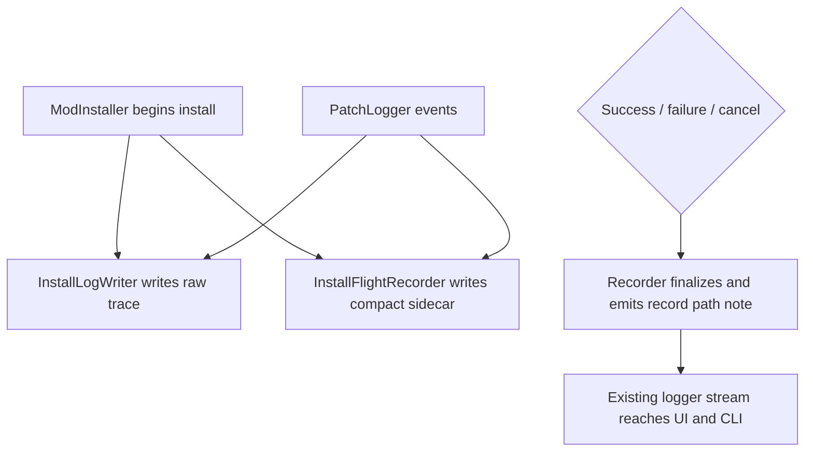

# feat: Add install flight recorder

## Summary

Add a compact install flight recorder alongside the existing raw install log so each install attempt leaves a shareable evidence bundle. The plan keeps install semantics unchanged, treats cancellation as its own terminal state, and surfaces the record path through the logger stream that UI and CLI already consume.

---

## Problem Frame

The raw install log already captures the detailed trace, but it is noisy for support and parity debugging. The install lifecycle also has a cancellation path that can bypass normal cleanup, so a recorder has to be designed around terminal outcomes rather than just happy-path completion (see origin: `docs/brainstorms/2026-05-24-install-flight-recorder-requirements.md`).

---

## Assumptions

*This plan was authored without synchronous user confirmation. The items below are agent inferences that fill gaps in the input and should be reviewed before implementation proceeds.*

- The record should surface after every install attempt, not only on warnings or errors.
- The first slice should announce the record location through the existing logger stream rather than adding a new modal or auto-open behavior.
- The new sidecar record is additive; it does not replace `installlog.txt`.
- The recorder should be instantiated only after the install actually begins, alongside `InstallLogWriter` inside `ModInstaller.Install()`, so confirmation-only exits do not leave stray artifacts.
- Recorder I/O is best-effort: install completion should still succeed or fail on the install outcome even if the sidecar cannot be written, but that recorder failure must be surfaced clearly.

---

## Requirements

### Recorder behavior

- R1. Every install attempt routes through the recorder and produces a durable sidecar when recorder I/O succeeds; recorder I/O failures are surfaced clearly without changing install semantics.
- R2. The record captures install context, resolved inputs, patch order, diagnostics, warnings or errors, and final outcome without becoming a second verbose log.

### Lifecycle handling

- R3. The record finalizes on success, failure, and cancellation/abort, with cancellation reported as a distinct terminal state.
- R4. The raw install log remains intact as the low-level trace and compatibility artifact.

### User-visible surfacing

- R5. The same record story is visible in both UI and CLI through existing logger plumbing.

**Origin actors:** A1 (KotOR mod player), A2 (mod maintainer / support helper), A3 (KPatcher itself)

**Origin flows:** F1 (record an install attempt), F2 (review a record after a successful install), F3 (diagnose a failed install)

**Origin acceptance examples:** AE1 (successful install exposes record path), AE2 (failure still finalizes record), AE3 (abort preserves record), AE4 (shared record reconstructs without rerun)

---

## Scope Boundaries

- Do not change install semantics, patch ordering, backup behavior, or the raw install log format.
- Do not add telemetry, dashboards, or a web-backed diagnostics surface.
- Do not introduce a separate install-record navigation flow for the first slice; existing logger-driven surfaces carry discoverability.

### Deferred to Follow-Up Work

- Auto-opening or previewing the install record in a dedicated UI surface.
- Any broader telemetry, analytics, or release-gate integration built from the same evidence stream.

---

## Context & Research

### Relevant Code and Patterns

- `src/KPatcher.Core/Patcher/ModInstaller.cs` creates `InstallLogWriter`, subscribes to `PatchLogger.LogAdded`, and already owns install start/completion/failure flow.
- `src/KPatcher.Core/Logger/InstallLogWriter.cs` shows the current raw-log pattern: file-backed, temp-dir friendly, exact prefixes for compatibility, and explicit flush/dispose behavior.
- `src/KPatcher.Core/Logger/PatchLogger.cs` is the shared in-memory event stream for diagnostics, and `LogType.Diagnostic` is already treated as lower-level than the mirrored install log.
- `src/KPatcher.Core/Logger/RobustLogger.cs` is the fail-soft logging precedent: logging should not crash the app if file writes fail.
- `src/KPatcher.UI/ViewModels/MainWindowViewModel.cs` and `src/KPatcher.UI/Program.cs` already expose logger output in UI and CLI, so a new note from `ModInstaller` will naturally surface there without new plumbing.

### Institutional Learnings

- `docs/solutions/architecture-patterns/install-flight-recorder.md` says to keep the raw install log as the source of truth and layer a compact shareable record on top instead of turning the recorder into another verbose dump.

### External References

- None needed; repo evidence is sufficient for this slice.

---

## Key Technical Decisions

- **Add a dedicated flight recorder sidecar instead of rewriting `installlog.txt`.** The raw log stays compatible and verbose; the recorder is the compact support artifact.
- **Make finalization cancellation-safe.** The current hard-exit cancellation path in `ModInstaller` would skip cleanup, so the plan needs a cleanup-friendly abort path before the recorder can be trusted and cancellation needs to stay distinct from generic failure.
- **Use the existing logger stream for discoverability.** A record path note emitted by `ModInstaller` is enough for both UI and CLI to tell users where the artifact landed.
- **Keep the recorder plain text and compact.** The first slice should preserve the evidence bundle shape, not expand into telemetry or a second debug transcript.

---

## Open Questions

### Resolved During Planning

- **Should the record surface on every install or only on noisy runs?** Use every install attempt; that keeps the artifact dependable and makes support requests easier to answer.
- **Do UI and CLI need separate recorder code paths?** No; the existing logger plumbing already reaches both surfaces, so the record note can come from the installer once.
- **Does cancellation count as a failure?** No; the recorder should keep aborted installs separate from error exits so the support artifact reflects the terminal state accurately.

### Deferred to Implementation

- **Exact section order and labels inside the recorder file:** settle after the writer exists and the output can be reviewed against real install runs.
- **How much terminal-state detail to preserve for cancel vs. failure:** finalize after the cancellation refactor shows what data is reliably available at cleanup time.

---

## High-Level Technical Design

> *This illustrates the intended approach and is directional guidance for review, not implementation specification. The implementing agent should treat it as context, not code to reproduce.*

---

## Implementation Units

### U1. Add a compact flight recorder helper

**Goal:** Create the sidecar writer and record format so a single install attempt can produce a shareable evidence bundle without replacing the raw log.

**Requirements:** R1, R2, R4

**Dependencies:** None

**Files:**
- Create: `src/KPatcher.Core/Logger/InstallFlightRecorder.cs`
- Modify: `src/KPatcher.Core/Resources/PatcherResources.resx`
- Test: `tests/KPatcher.Tests/Logger/InstallFlightRecorderTests.cs`

**Approach:**
- Keep the recorder plain text and file-backed, with a compact header that names the install context and a short terminal section that records success/failure/cancel state.
- Let the recorder own its own output path (the sidecar record), while `InstallLogWriter` continues to own `installlog.txt`.
- Capture diagnostics directly from installer state or the diagnostic logger stream so the sidecar includes fields `InstallLogWriter` does not mirror into `installlog.txt`.
- Reuse the repo's existing logging/resource style so the record's wording stays consistent with other install messages.

**Execution note:** Start with a failing helper test for the recorder's file shape before writing the helper itself.

**Patterns to follow:**
- `src/KPatcher.Core/Logger/InstallLogWriter.cs`
- `src/KPatcher.Core/Logger/RobustLogger.cs`
- `src/KPatcher.Core/Logger/PatchLogger.cs`

**Test scenarios:**
- Happy path: given a temp mod directory and install metadata, the recorder writes a readable sidecar file with header, install context, diagnostic details, and terminal state.
- Edge case: a record with no warnings or errors still renders a compact, readable file without blank sections.
- Error path: invalid or missing mod-path input is rejected instead of silently creating a record in the wrong place.
- Integration: disposing the recorder flushes the file to disk so the evidence bundle survives process exit.

**Verification:**
- A temp install run produces a sidecar record file alongside the existing raw log.
- The raw install log remains unchanged by the new helper.

---

### U2. Wire the recorder into the installer lifecycle

**Goal:** Make `ModInstaller` create, finalize, and announce the recorder for success, failure, and cancellation/abort outcomes.

**Requirements:** R1, R3, R4, R5

**Dependencies:** U1

**Files:**
- Modify: `src/KPatcher.Core/Patcher/ModInstaller.cs`
- Test: `tests/KPatcher.Tests/Patcher/InstallFlightRecorderIntegrationTests.cs`

**Approach:**
- Instantiate the recorder alongside `InstallLogWriter` inside `ModInstaller.Install()` after the install has actually begun, feed it the same high-value lifecycle events plus direct diagnostics, and finalize it in the same terminal paths that already dispose the raw log.
- Replace the hard-exit cancellation branch with a cleanup-friendly cancellation path that still unwinds through `finally`, so aborts can run recorder finalization and remain distinguishable from generic failures.
- Emit one concise completion note that points at the record path; the existing logger plumbing will carry it to both UI and CLI.

**Execution note:** Start with failing integration tests for success, failure, and cancellation finalization before changing the cancellation path.

**Patterns to follow:**
- `src/KPatcher.Core/Patcher/ModInstaller.cs` install start / success / failure / `finally` structure.
- `src/KPatcher.Core/Logger/InstallLogWriter.cs` lifetime management and explicit dispose behavior.
- `tests/KPatcher.Tests/Patcher/ModInstallerTests.cs` and `tests/KPatcher.Tests/Config/ConfigTests.cs` for temp-dir installer harnesses.

**Test scenarios:**
- Happy path: a successful install writes both the raw log and the compact record, and the record-path note appears in the logger stream.
- Edge case: an install with no warnings or errors still finalizes the recorder and emits a useful completion note.
- Error path: a thrown patch failure still finalizes the recorder before the exception escapes and the record captures the failure state.
- Error path: cancellation does not bypass cleanup, does not rely on `Environment.Exit(0)`, and still leaves a finalized record that is distinct from failure.
- Error path: confirmation-only exits do not create a recorder artifact because recorder creation starts only after the install actually begins.
- Integration: the raw install log remains present and compatible after the recorder is added, and diagnostic lines that are not mirrored to `installlog.txt` still appear in the sidecar.

**Verification:**
- Every terminal installer outcome leaves a finalized recorder artifact.
- Cancellation no longer skips cleanup for the install record.
- The cancellation test exercises the cleanup-friendly abort path, not the old `Environment.Exit(0)` branch.

---

### U3. Prove headless surfacing of the record path

**Goal:** Confirm that the new recorder note reaches CLI users through the existing logger stream without adding CLI-specific plumbing.

**Requirements:** R1, R5

**Dependencies:** U2

**Files:**
- Modify: `tests/KPatcher.Tests/ProgramCliExecutionTests.cs`

**Approach:**
- Add a minimal install scenario that exercises `Program.RunCli` and confirms the record-path note appears in stdout/stderr as appropriate.
- Keep the CLI harness focused on the emitted note and artifact existence; do not add new CLI surface area just for the recorder.
- Rely on the existing logger/event wiring for UI parity rather than introducing a second implementation path.

**Patterns to follow:**
- `tests/KPatcher.Tests/ProgramCliExecutionTests.cs` existing parse/output assertions.
- Existing `Program.RunCli` logger mapping in `src/KPatcher.UI/Program.cs`.

**Test scenarios:**
- Happy path: a CLI install on a minimal temp mod/game emits the record-path note and leaves the sidecar file in place.
- Edge case: the read-only CLI commands continue to avoid any record-path noise.
- Integration: the CLI output and file-system artifact agree on the same recorder location.

**Verification:**
- Headless users can see where the install record landed using the same logger stream they already read.

---

## System-Wide Impact

- **Interaction graph:** `ModInstaller` now owns two file-backed artifacts (`installlog.txt` and the compact record), while the existing `PatchLogger` stream continues to feed UI and CLI output.
- **Error propagation:** file-write failures in the recorder should remain fail-soft where possible so logging does not break installs, matching the repo's logging style.
- **State lifecycle risks:** cancellation is the key lifecycle risk because the current hard-exit path can skip cleanup; the plan must make aborts finalize the recorder and preserve the abort-vs-failure distinction.
- **API surface parity:** UI and CLI do not need separate recorder implementations because both already consume the same logger stream.
- **Integration coverage:** the most important proof is that success, failure, and cancellation all leave a finalized record without changing install semantics.
- **Unchanged invariants:** patch order, backup behavior, and the raw install log format stay intact.

---

## Risks & Dependencies

| Risk | Mitigation |
|------|------------|
| Cancellation can still bypass recorder cleanup if the hard-exit behavior survives | Replace the exit path with a cleanup-friendly cancellation flow and cover it with integration tests |
| The recorder drifts into a second verbose log | Keep the first format intentionally compact and assert on section shape rather than raw event spam |
| The new note is written but not visible enough to users | Emit the record-path note through `PatchLogger` so both UI and CLI naturally surface it |

---

## Documentation / Operational Notes

- Keep `docs/solutions/architecture-patterns/install-flight-recorder.md` aligned with the shipped behavior if the implementation changes the recorder shape materially.
- No broader docs update is required unless the final artifact naming or user-facing note wording changes meaningfully.

---

## Sources & References

- Origin document: `docs/brainstorms/2026-05-24-install-flight-recorder-requirements.md`
- Strategy: `STRATEGY.md`
- Institutional learning: `docs/solutions/architecture-patterns/install-flight-recorder.md`
- Relevant code: `src/KPatcher.Core/Patcher/ModInstaller.cs`, `src/KPatcher.Core/Logger/InstallLogWriter.cs`, `src/KPatcher.Core/Logger/PatchLogger.cs`, `src/KPatcher.Core/Logger/RobustLogger.cs`, `src/KPatcher.UI/Program.cs`, `src/KPatcher.UI/ViewModels/MainWindowViewModel.cs`
- Relevant tests: `tests/KPatcher.Tests/Logger/InstallLogWriterTests.cs`, `tests/KPatcher.Tests/Patcher/ModInstallerTests.cs`, `tests/KPatcher.Tests/Config/ConfigTests.cs`, `tests/KPatcher.Tests/ProgramCliExecutionTests.cs`
