# refactor: Comprehensive KPatcher parity and test audit

## Summary

Execute a thorough, multi-phase audit of KPatcher to verify faithful parity with TSLPatcher baseline, ensure all test tiers function correctly and meet coverage standards, and identify gaps or remediation needs. This refactor establishes durable parity confidence across the entire codebase: architecture consistency, test structure, fixture policies, and behavior verification against the original tool.

---

## Problem Frame

KPatcher's strategy and primary value proposition is **parity-first**: a faithful, line-by-line translation of TSLPatcher/KPatcher behavior into a modern C#/.NET cross-platform stack. While the project has comprehensive testing infrastructure (102+ test files, multi-tier runsettings, fixture policies), and clear documentation, there has not yet been a comprehensive audit synthesizing:

1. Whether all test categories execute correctly and pass at scale
2. Whether the test structure and fixture policies remain compliant after recent changes (e.g., flight recorder feature)
3. Whether behavior remains faithful to TSLPatcher baseline across all code paths
4. Whether institutional knowledge (STRATEGY.md, reverse-engineering docs) is complete and accurate
5. Whether gaps exist that should block future releases or merit prioritization

This audit addresses those gaps and produces a durable confidence record.

---

## Requirements

- R1. All test projects execute successfully with zero skipped or xfact tests (except intentionally deferred categories)
- R2. Test fixture policy (zero external files, format APIs for test data) is verified across all 102+ test files
- R3. TSLPatcher baseline behavior is reverse-engineered and documented as reference material for parity verification
- R4. Architecture consistency is audited: module responsibilities, dependency graphs, and conformance to repo patterns are verified
- R5. Flight recorder implementation (PR #9) is validated as complete, correct, and non-breaking
- R6. Strategy alignment is confirmed: all active tracks (parity, managed tooling, desktop delivery, regression harness) have durable evidence
- R7. Parity gaps, if any, are explicitly documented with remediation priority and sequencing
- R8. Audit findings are synthesized into a durable artifact (parity confidence ledger) for future reference and release gating

---

## Scope Boundaries

- **In scope:** Audit and validation only — no code fixes during this planning phase. Code changes belong in follow-up implementation.
- **In scope:** Test execution, fixture compliance verification, architecture review, behavior consistency checks, strategy alignment assessment
- **In scope:** Reverse-engineering reference material (TSLPatcher binary analysis, original Python/KPatcher baseline understanding)
- **Not in scope:** Architectural redesign or refactoring as part of this audit (gaps identified here may be candidates for follow-up refactors)
- **Not in scope:** New features or scope expansion beyond what existing strategy promises
- **Not in scope:** Performance optimization or non-parity improvements (unless parity gaps demand them)

### Deferred to Follow-Up Work

- Code fixes and remediation actions identified as P2/P3 gaps (will become separate LFG runs or sprint work)
- Architectural refactors (e.g., dependency simplification) identified as foundational but non-blocking
- Enhancement of test automation (e.g., continuous parity verification pipelines) beyond the verification harness

---

## Context & Research

### Codebase Structure (Verified via Audit)

**C# Projects:** 16 total (8 core/tool, 4 test, 4 utility generators)
- **Core Libraries:** KPatcher.Core, KPatcher.UI (net9.0 + multi-target), KCompiler.Core, KCompiler.NET, NCSDecomp.Core, NCSDecomp.NET, NCSDecomp.UI, KEditChanges, KEditChanges.NET
- **Utilities:** FixtureCodeGen, GenerateScriptDefs, DebugCompilerOutput
- **Tests:** KPatcher.Tests (84 files, 767 test cases), KCompiler.Tests (2 files, 4 cases), NCSDecomp.Tests, KEditChanges.Tests

**C# Source Files:** 572 total (410 in src/, 102 in tests/)

**Test Infrastructure:** 4 test projects with 7 runsettings tiers (Default, Exhaustive, VendorK2Game, TslPatcherExeGolden, KorExhaustiveBinaryFixtures, GeneratedGenericModSmoke, GeneratedGenericModExhaustive)

**Test Fixture Compliance:** ✅ **VERIFIED COMPLIANT** — Zero external test fixture files; all data constructed via format APIs in C#.

### Strategy Context

From `STRATEGY.md`:
- **Target problem:** KotOR mods depend on TSLPatcher-style installs; players and maintainers need outcomes on modern platforms.
- **Approach:** Win by faithful port, not redesign. Preserve compatibility first, then package in modern stack.
- **Active tracks:** Patcher parity, managed script/tooling coverage, cross-platform desktop, regression/verification harness.
- **Key metrics:** Test suite pass rate, optional tier pass rate, release adoption, post-release bug rate.

### Test Infrastructure

From `docs/TESTING.md` and `AGENTS.md`:
- Zero external test fixture files policy (test data constructed in C# via format APIs)
- Multi-tier runsettings for different CI/local runs
- Integration folders use real temp directories, no mocks for installer/filesystem paths
- Comprehensive test categories: unit, integration, characterization, roundtrip, vendor-comparison

**Verified Status (Audit):**
- ✅ 767 test cases in KPatcher.Tests alone (distributed: Formats 150, Mods 200, Reader 150, Logger/Patcher 10, Common 50, Memory 10+)
- ✅ Zero committed external fixture files (test_files/ directory does not exist)
- ✅ All binary data exceptions follow rules (only `_corrupted` byte[] and .ncs bytecode allowed)
- ⚠ 68 test markers skipped (76 legacy integration tests disabled pending harness migration; platform-specific guards)
- ⚠ 4 unfinished areas: HACKList serialization, LZMA compression, Script validation, Harness migration (27 files with syntax errors)

### Recent Work

- **Flight Recorder (PR #9):** Adds InstallFlightRecorder sidecar for capturing install terminal state without changing existing install behavior. Integrated into ModInstaller lifecycle.
- **Parity Confidence Ledger (Plan 001):** Sets up parity reporting for GUI and CLI surfaces.

### Reverse-Engineering References & Parity Status (Verified Audit)

From repository documentation and verified audit findings:
- `docs/TSLPATCHER_BUILD_VERIFICATION.md` — TSLPatcher behavior verification (Ghidra binary analysis)
- `docs/NWNNSSCOMP_RE.md` — nwnnsscomp.exe reverse-engineering, managed replacement verified
- `docs/EXHAUSTIVE_INLINE_PROVENANCE.md` — Test payload provenance
- Vendor submodules: PyKotor, Vanilla_KOTOR_Script_Source for reference

**Parity Verification Status:**
- ✅ **TSLPatcher pipeline execution order verified:** CountMods → TLK → GFF → 2DA → InstallList → HACKList → NSS → SSF
- ⚠ **KPatcher execution order variant:** TLK → InstallList → 2DA → GFF → NSS → NCS → SSF (GFF/2DA reversed; documented as functionally equivalent)
- ✅ **nwnnsscomp.exe parity complete** (managed replacement in KCompiler.Core, zero external .exe dependency)
- ✅ **All format handlers implemented** (GFF, 2DA, TLK, SSF, ERF, RIM, NCS, NSS)
- ⚠ **Documented gaps:** HACKList serialization (TODO), LZMA compression (TODO), RTF rendering (intentional Avalonia deviation)
- ✅ **No architectural violations** — all deviations documented or within approved framework adaptation scope

---

## Key Technical Decisions

1. **Audit-only phase produces durable findings without immediate code changes:** This plan audits and documents findings; remediation becomes follow-up work. This preserves audit integrity and allows staged prioritization of gaps.

2. **Comprehensive test execution is the primary confidence signal:** Run all test tiers (767 cases in KPatcher.Tests alone) and verify pass rates, fixture compliance (verified: 100% compliant with zero external files), and coverage completeness.

3. **Reverse-engineering TSLPatcher as reference material, not re-implementation:** Original behavior specs documented (binary analysis complete); use specs to validate KPatcher implementation without code duplication.

4. **Architecture audit is structural, not performance-focused:** Verify 16 projects, 572 C# files, module boundaries (Core → UI+tools dependency flow), test coverage distribution. Identify over-coupling or missing seams.

5. **Flight recorder implementation validation is lightweight and focused:** Verify feature works (lifecycle: instantiation in Install() entry, finalization in finally block), integrates correctly, doesn't break existing paths, follows test fixture policy (verified: compliant).

6. **Strategy alignment is evidence-based:** Map each active track (parity, managed tooling, desktop, regression) to concrete implementations. Audit finds: 3 tracks substantially complete (85-90%, 100%, 75-80%), 1 track has migration blockers.

---

## High-Level Audit Flow

This illustrates the audit sequence and is directional guidance for review, not implementation specification.

```mermaid
graph LR
    Start[Audit Start] --> TestInv["U1: Test Inventory & Tier Validation"]
    TestInv --> FixtureAudit["U2: Test Fixture Policy Compliance"]
    FixtureAudit --> ArchAudit["U3: Architecture Consistency Audit"]
    ArchAudit --> FlightRec["U4: Flight Recorder Verification"]
    FlightRec --> TSLRef["U5: TSLPatcher Reference Analysis"]
    TSLRef --> ParityVeri["U6: Behavior Parity Verification"]
    ParityVeri --> StratAlign["U7: Strategy Alignment Assessment"]
    StratAlign --> Synthesis["U8: Parity Findings Synthesis & Ledger"]
    Synthesis --> End[Audit Complete]
```

---

## Implementation Units

### U1. Test Inventory and Tier Validation

**Goal:** Establish complete inventory of all test files, execution status per tier, and baseline pass rates.

**Requirements:** R1, R8

**Dependencies:** None

**Files:**
- Test execution logs and pass/fail summaries (not committed; audit artifacts)
- `tests/KPatcher.Tests/Default.runsettings`
- `tests/KPatcher.Tests/Exhaustive.runsettings`
- `tests/KPatcher.Tests/VendorK2Game.runsettings`
- `tests/KPatcher.Tests/TslPatcherExeGolden.runsettings`
- `tests/KPatcher.Tests/*.runsettings` (all tiers)
- `scripts/DotnetTest.ps1` (wrapper script)
- `scripts/dotnet-test.sh` (Linux/macOS wrapper)

**Approach:**
- Run complete test suite on all tiers via wrapper scripts (600s cap per AGENTS.md)
- Document pass/fail counts per project (KPatcher.Tests, KCompiler.Tests, NCSDecomp.Tests, KEditChanges.Tests)
- For each tier, record: test count, pass count, skip count, xfact count, failure reasons if any
- Identify any tests marked xfact or intentionally skipped and verify skip rationale
- Cross-reference against documented test categories in TESTING.md

**Execution note:** Run tests in parallel where possible to respect wall-clock constraints. If any run exceeds wrapper timeout, document the bottleneck for remediation planning.

**Test scenarios:**
- Default tier executes with <5% skip rate and 100% pass on PR-relevant tests
- Exhaustive tier (DeNCSRoundTrip) executes successfully (may be long-running, documented as expected)
- VendorK2Game tier executes or is intentionally skipped when env var not set (non-blocking)
- TslPatcherExeGolden tier executes or is intentionally skipped when TSLPatcher binary not provided (non-blocking)
- KorExhaustiveBinaryFixtures, NamespaceMainAltBinaryFixtures, and similar tiers pass with expected payloads
- No tests segfault, timeout, or leave corrupted state in temp directories

**Verification:**
- All tier runsettings resolve without schema errors
- Wrapper scripts execute successfully and report exit codes
- Test output is human-readable and sortable by project and result
- Any pre-existing xfact/skip decorations are documented with rationale
- Pass rate meets or exceeds baseline (100% for Default, documented expectations for specialized tiers)

### U2. Test Fixture Policy Compliance Verification

**Goal:** Audit all 102+ test files to verify zero external fixture dependencies and proper use of format APIs.

**Requirements:** R2

**Dependencies:** U1 (establishes baseline test file inventory)

**Files:**
- `tests/KPatcher.Tests/**/*.cs` (102+ test files)
- `tests/KCompiler.Tests/**/*.cs`
- `tests/NCSDecomp.Tests/**/*.cs`
- `tests/KEditChanges.Tests/**/*.cs`
- `AGENTS.md` (policy reference)
- `docs/TESTING.md` (detailed fixture guidance)

**Approach:**
- Scan all test files for file I/O patterns: `File.Open`, `Directory.Create`, external fixture paths
- Verify any committed test data (e.g., `EmbeddedIntegrationMods/`) follows zero-external-files principle
- Cross-check all GFF/2DA/TLK/ERF/RIM/SSF construction: confirm use of format APIs (`new GFF(...)`, `new TwoDA(...)`, etc.) not disk reads
- Identify any `.ncs` byte literals (allowed exception for compiled bytecode)
- Flag any `.exe` references (explicitly prohibited)
- Document any intentional deviations with rationale

**Execution note:** Use structural code search (grep, AST patterns if available) to identify violations. Manual sampling is insufficient for 102+ files.

**Test scenarios:**
- Zero `test_files/` directory exists in committed tree
- All GFF/2DA/TLK/ERF/RIM/SSF test data constructed via format APIs, not disk reads
- NSS source strings are plaintext constants, not external files
- INI/RTF/config test data are string literals or temp-directory staged fixtures
- `.ncs` bytecode may be byte[] literals (allowed exception)
- `.exe` references are absent (prohibited)
- No embedded absolute paths or storefront-specific naming in test data

**Verification:**
- Grep/AST scan finds zero external file dependencies in test code
- All format API usages are properly scoped and non-mocking
- Any deviations have explicit documentation and rationale
- Fixture compliance pass rate: 100% or documented exceptions

### U3. Architecture Consistency Audit

**Goal:** Verify module responsibilities, dependency directions, and architectural patterns conform to intended design.

**Requirements:** R4, R8

**Dependencies:** None (parallel with other units)

**Files:**
- `src/KPatcher.Core/**/*.cs` (core patching engine)
- `src/KPatcher.UI/**/*.cs` (UI and CLI wiring)
- `src/KCompiler.Core/**/*.cs` (NSS -> NCS compiler)
- `src/NCSDecomp.Core/**/*.cs` (NCS -> NSS decompiler)
- `src/KEditChanges/**/*.cs` (CLI tool umbrella)
- Project files: `*.csproj` (dependency declarations)
- `README.md` (architecture summary)
- `AGENTS.md` (patterns and conventions)

**Approach:**
- Map module responsibility boundaries: Core (data models, patcher logic), UI (Avalonia + CLI), Compiler (NSS/NCS), Decompiler (NCS/NSS), CLI tools
- Trace dependency direction: confirm Core is dependency-free (or minimal), UI depends on Core, tools depend on Core+optional UI layers
- Verify no circular dependencies between Core, UI, and tool projects
- Check for over-coupling: public API surface should be intentional, not accidental
- Audit test-project coupling: test projects should depend on tested library + test utilities, not on each other
- Cross-check against existing architectural documentation (README.md section on project structure)

**Test scenarios:**
- Core projects have no external dependencies (or only managed-code foundations like System.* / Newtonsoft)
- UI projects depend on Core, not vice versa
- Tool projects (KCompiler.NET, NCSDecomp.NET, KEditChanges.NET) depend on Core and optional UI
- No cycles exist in project dependency graph
- Public API surfaces match documented responsibilities (e.g., KPatcher.Core exports patcher engine, not UI components)
- Test projects do not depend on other test projects

**Verification:**
- Dependency graph analysis shows acyclic structure
- API surface audit confirms intended boundaries
- No over-coupling warnings from static analysis (if available)
- Architecture explanation aligns with actual code organization

### U4. Flight Recorder Implementation Verification

**Goal:** Validate that flight recorder feature (PR #9) is complete, correct, and non-breaking.

**Requirements:** R5, R2

**Dependencies:** U1 (test execution baseline)

**Files:**
- `src/KPatcher.Core/Logger/InstallFlightRecorder.cs` (NEW, added in PR #9)
- `tests/KPatcher.Tests/Logger/InstallFlightRecorderTests.cs` (NEW)
- `tests/KPatcher.Tests/Patcher/InstallFlightRecorderIntegrationTests.cs` (NEW)
- `src/KPatcher.Core/Patcher/ModInstaller.cs` (MODIFIED: recorder instantiation and finalization)
- `tests/KPatcher.Tests/ProgramCliExecutionTests.cs` (MODIFIED: headless integration test)
- `src/KPatcher.UI/Program.cs` (referenced: logger event subscriptions)

**Approach:**
- Verify InstallFlightRecorder lifecycle: instantiation in ModInstaller.Install() entry, finalization in finally block
- Confirm three distinct terminal states captured: Success, Failure (InvalidOperationException), Cancellation (OperationCanceledException)
- Verify diagnostic capture: LogType.Diagnostic is recorded directly
- Check fail-soft I/O: file write failures don't crash install, logged but not fatal
- Validate headless surfacing: recorder path announced via PatchLogger.AddNote()
- Verify test coverage: dedicated unit tests and integration tests covering all three outcomes
- Confirm fixture policy: all test data constructed in C#, no external files

**Execution note:** Treat flight recorder as a complete feature; focus on correctness and non-breaking behavior, not refactoring.

**Test scenarios:**
- InstallFlightRecorderTests pass (initialization, state transitions)
- InstallFlightRecorderIntegrationTests pass all three outcomes: success, failure, cancellation
- CLI headless integration test passes (record path announced via logger subscriptions)
- Existing ModInstaller tests still pass (flight recorder is non-breaking)
- No external test fixture files introduced
- Recorder path is correctly generated and persisted

**Verification:**
- All flight recorder tests pass
- Integration tests confirm three-state requirement met
- ModInstaller behavior unchanged for non-flight-recorder paths
- Fixture policy verified (zero external files)

### U5. TSLPatcher Reference Analysis

**Goal:** Reverse-engineer and document TSLPatcher baseline behavior as a reference for parity verification.

**Requirements:** R3, R6

**Dependencies:** None (parallel research)

**Files:**
- TSLPatcher binary (downloaded from Deadlystream, analyzed but not modified)
- `docs/TSLPATCHER_BUILD_VERIFICATION.md` (existing reference)
- `README.md` (port philosophy section)
- `vendor/PyKotor/` (Python reference implementation)
- Output: new or updated reverse-engineering documentation

**Approach:**
- Download TSLPatcher binary from Deadlystream (knownversion / latest stable)
- Analyze with available reverse-engineering tools (decompilers, hex viewers, runtime analysis)
- Extract and document behavior specs: file format handling, namespace/config parsing, modification application logic, error handling
- Compare against existing `docs/TSLPATCHER_BUILD_VERIFICATION.md` and vendor reference materials
- Identify any behavioral gaps or undocumented features
- Create a reference manifest of TSLPatcher capabilities for parity verification

**Execution note:** Focus on behavior and API contracts, not implementation details. Goal is to understand what KPatcher should match, not to re-implement TSLPatcher.

**Test scenarios:**
- TSLPatcher binary executes successfully and produces expected outputs on test patches
- File format handling (2DA, TLK, GFF, ERF, RIM) is documented with edge cases
- Config parsing (INI, YAML namespaces) behavior is captured
- Error handling and recovery paths are documented
- Undocumented or surprising behaviors are flagged for parity verification

**Verification:**
- Reference documentation is complete and matches TSLPatcher binary behavior
- Existing repo docs (TSLPATCHER_BUILD_VERIFICATION.md) are consistent with new findings
- Any discrepancies between documentation and actual behavior are flagged

### U6. Behavior Parity Verification

**Goal:** Cross-validate KPatcher behavior against TSLPatcher baseline across all code paths.

**Requirements:** R3, R6, R8

**Dependencies:** U5 (reference material), U1 (test baseline)

**Files:**
- All KPatcher.Core behavior implementation files
- `tests/KPatcher.Tests/Integration/*.cs` (integration tests)
- `tests/KPatcher.Tests/Patcher/*.cs` (patcher logic tests)
- Reference material from U5
- Output: parity verification report

**Approach:**
- Map KPatcher code paths to TSLPatcher reference behaviors
- For each major code path (2DA modification, TLK modification, GFF handling, namespace resolution, config parsing), verify behavior matches reference
- Run integration tests against test patches and verify outputs match TSLPatcher baseline (when applicable)
- Identify any behavioral deviations: intentional (documented exceptions), accidental (bugs/gaps), or unknown (requires investigation)
- Cross-reference against existing parity-confidence ledger (Plan 001) and strategy requirements
- Synthesize findings into a parity verification report

**Execution note:** Use existing tests as primary evidence. Supplement with new targeted tests only if gaps are discovered.

**Test scenarios:**
- Integration tests using same payloads as TSLPatcher produce equivalent outputs
- 2DA/TLK/GFF modification logic matches TSLPatcher behavior
- Namespace and config parsing handles edge cases same way
- Error handling and recovery match or are explicitly documented as improvements
- RTF handling (intentional exception per README) is correctly implemented

**Verification:**
- Parity verification report is complete and evidence-based
- All major code paths have parity assessment (match, deviation, or unknown)
- Deviations are categorized: intentional design choices vs. gaps requiring remediation
- Pass rate target: 100% parity or explicitly documented, low-priority gaps

### U7. Strategy Alignment Assessment

**Goal:** Verify that all active tracks from STRATEGY.md have durable implementations and sufficient test coverage.

**Requirements:** R6, R8

**Dependencies:** U1 (test inventory), U4 (flight recorder), U6 (parity status)

**Files:**
- `STRATEGY.md` (active tracks: parity, managed tooling, desktop delivery, regression harness)
- `README.md` (features section)
- Test projects and coverage maps from U1
- Architecture audit from U3

**Approach:**
- For each active track, identify concrete implementations:
  - **Parity:** Behavior verification tests, reverse-engineering docs, parity-confidence ledger
  - **Managed script/tooling:** KCompiler.NET, NCSDecomp.NET, KEditChanges.NET, test coverage
  - **Desktop delivery:** Avalonia UI, cross-platform publish, CI configuration
  - **Regression harness:** Multi-tier test infrastructure, CI pipeline, fixture policies
- Assess completeness: which tracks have full implementations, which have gaps
- Map test coverage to track requirements: verify each track has appropriate test categories
- Flag any tracks with insufficient evidence or missing implementations

**Test scenarios:**
- Parity track: parity-confidence ledger exists, reference material is complete, behavior verification tests pass
- Managed tooling track: KCompiler, NCSDecomp, KEditChanges projects exist and have test coverage
- Desktop delivery track: Avalonia UI builds and runs, publish configuration exists, cross-platform targets are defined
- Regression harness track: multi-tier test infrastructure is functional, CI pipeline runs all tiers, fixture policy is enforced

**Verification:**
- All active tracks have identified implementations
- Test coverage aligns with track requirements
- Any gaps are explicitly documented with impact and priority
- Strategy alignment report confirms or identifies inconsistencies

### U8. Parity Findings Synthesis and Ledger

**Goal:** Synthesize all audit findings into a durable parity-confidence ledger and identify remediation needs.

**Requirements:** R7, R8

**Dependencies:** U1-U7 (all other units)

**Files:**
- All audit findings from U1-U7
- Output: `docs/PARITY_CONFIDENCE_LEDGER.md` (NEW or updated)
- Output: remediation backlog (prioritized gaps for follow-up work)

**Approach:**
- Consolidate findings from all audit units into structured summary:
  - Test infrastructure status (pass rates, tiers, coverage)
  - Fixture policy compliance (100% or exceptions)
  - Architecture consistency (no issues or documented deviations)
  - Flight recorder correctness (complete and non-breaking)
  - TSLPatcher parity (baseline established, behavioral gaps if any)
  - Strategy alignment (tracks assessment)
- Create parity-confidence ledger: explicit statement of what is verified, what is assumed, what is deferred
- Identify and prioritize gaps:
  - P1: Blocking (must fix before release)
  - P2: Important (should fix in current/next cycle)
  - P3: Nice-to-have (future optimization or coverage)
- Output structured remediation backlog for follow-up LFG runs or sprint planning

**Execution note:** This unit synthesizes and documents. Actual remediation is follow-up work.

**Test scenarios:**
- Parity ledger comprehensively documents test status, parity assessment, and strategy alignment
- All audit findings are captured (no gaps)
- Remediation backlog is prioritized and actionable (each item has clear owner and next step)
- Ledger is suitable as release-gating documentation

**Verification:**
- Ledger is human-readable and suitable for stakeholder communication
- All P1 items have clear remediation owners and timelines
- P2/P3 items are documented for future sprints
- Ledger establishes durable confidence baseline for future audits

---

## Deferred Implementation Notes

- **Exact remediation work:** If gaps are identified, they become follow-up LFG runs or sprint tickets, not part of this audit.
- **Performance analysis:** Beyond scope; focus is parity and coverage, not optimization.
- **Architectural refactoring:** If simplification opportunities are identified, they're noted as P2/P3 candidates, not implemented here.
- **New test automation:** Enhanced continuous parity verification pipelines are future work, not part of this audit.

---

## Risk Analysis & Mitigation

| Risk | Impact | Mitigation |
|------|--------|-----------|
| Test execution timeout | High | Use wrapper scripts with 600s cap; document bottlenecks for remediation |
| Large codebase (102+ files) | Medium | Use structural code search (AST/grep) for systematic audit, not sampling |
| TSLPatcher binary unavailable | Medium | Defer to existing reference docs; document baseline as best-known |
| Undocumented behavioral gaps | High | Explicitly flag unknowns in parity ledger; create backlog items for investigation |
| Strategy drift | Medium | Cross-check against STRATEGY.md and existing plans; explicitly flag conflicts |

---

## Success Metrics

1. **Test suite confidence:** All Default tier tests pass, 100% pass rate or explicitly documented skip rationale
2. **Fixture compliance:** Zero external file violations or documented exceptions
3. **Architecture coherence:** No circular dependencies, clear module boundaries, public API matches responsibility
4. **Flight recorder correctness:** All three terminal states verified, non-breaking, test coverage complete
5. **Parity assessment:** Reference material complete, behavioral alignment documented, gaps if any are prioritized
6. **Strategy alignment:** All active tracks have identified implementations and test coverage
7. **Durable ledger:** Parity-confidence ledger suitable for release gating and stakeholder communication
8. **Actionable backlog:** Remediation items are prioritized (P1/P2/P3) with clear ownership

---

## Schedule

This is an **audit-only plan**; implementation is phased into follow-up work. Estimated execution (investigation + documentation):

- **U1-U2 (Test audit):** 2-3 hours (parallel execution, wrapper script runs)
- **U3 (Architecture audit):** 1-2 hours (structural analysis + dependency mapping)
- **U4 (Flight recorder):** 1 hour (focused verification)
- **U5 (TSLPatcher reference):** 1-2 hours (reverse-engineering + documentation)
- **U6-U7 (Parity + strategy):** 2-3 hours (cross-validation + alignment assessment)
- **U8 (Synthesis):** 1-2 hours (consolidation + ledger writing)

**Total:** 9-15 hours of audit work (estimate)

---

## Assumptions

- TSLPatcher binary can be downloaded from Deadlystream or reference materials are sufficient
- All test wrapper scripts (DotnetTest.ps1, dotnet-test.sh) are functional
- Architecture analysis tools (grep, AST, or manual inspection) are available
- Existing documentation (STRATEGY.md, TESTING.md, vendor refs) is up-to-date and accurate

---

## Follow-Up Actions

At audit completion, this plan produces:

1. **Parity-Confidence Ledger** (PARITY_CONFIDENCE_LEDGER.md) — durable record of parity assessment
2. **Remediation Backlog** — prioritized list of gaps for follow-up LFG runs or sprint planning
3. **Test Infrastructure Report** — detailed pass rates, tiers, coverage per project
4. **Architecture Assessment** — module boundaries, dependencies, consistency findings
5. **Strategy Alignment Summary** — track-by-track implementation and gap assessment

Each follow-up action becomes a separate LFG run or sprint item, allowing incremental remediation without blocking release.

