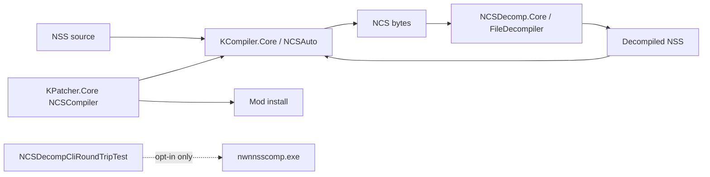

# feat: DeNCS managed port verification and gap closure

## Summary

The DeNCS Java→C# port is already landed in `NCSDecomp.Core` (~277 source files) with KCompiler integration and 14+ NCS/NSS test classes in `KPatcher.Tests`. This plan verifies `/lfg` completion criteria, enforces **managed-first / no registry-spoofer** product policy on remaining external-compiler seams, runs the full default test suite, and documents any deliberate supersessions.

---

## Problem Frame

The `/lfg` command requires every relevant DeNCS Java file to be accounted for in C#, compiler/decompiler integration via **KCompiler** + **NCSDecomp.Core**, and passing NCS/NSS tests — without depending on registry spoofing or `nwnnsscomp.exe` for core product flows. Research shows the port is substantially complete; remaining work is verification, policy alignment on patcher fallback paths, and test confirmation.

---

## Assumptions

*This plan was authored in LFG pipeline (headless) mode.*

- `docs/NCS_DENCS_JAVA_ACCOUNTING.md` remains the authoritative Java→C# checklist; no new Java files exist in-repo.
- `vendor/DeNCS` may be absent locally (submodule optional); exhaustive `NCSDecompCliRoundTripTest` stays opt-in with `ExternalCompiler` / `DeNCSRoundTrip` traits.
- Removing Windows `nwnnsscomp.exe` fallback from `NCSCompiler` is in-scope for product policy; keeping it only in explicitly legacy/opt-in test harnesses is acceptable.

---

## Requirements

- R1. Every relevant DeNCS `.java` file is accounted for in `NCSDecomp.Core`, `KPatcher.Core/Formats/NCS`, or documented as deliberately superseded (see `docs/NCS_DENCS_JAVA_ACCOUNTING.md`).
- R2. Compiler and decompiler product paths use **managed** KCompiler + NCSDecomp.Core — no registry spoofing; no default `nwnnsscomp.exe` dependency in patcher install or NCSDecomp.NET core flows.
- R3. All default-tier NCS/NSS tests in `KPatcher.Tests` pass via `./scripts/dotnet-test.sh`.
- R4. At least ~8 NCS/NSS test fixture classes exist with managed compile/decompile coverage (already present; verify and fix if any fail).
- R5. Broken doc references (e.g. missing `PORTING_STATUS.md`) are corrected to point at authoritative accounting doc.

---

## Scope Boundaries

- Do not re-port already-landed DeNCS Core AST/parser stack.
- Do not require `vendor/DeNCS` or `nwnnsscomp.exe` for default CI to pass.
- Do not add committed binary test fixtures beyond policy (`byte[]` `.ncs` literals only).
- Do not upgrade C# beyond 7.3.

### Deferred to Follow-Up Work

- Exhaustive 23k+ vanilla `DeNCSRoundTrip` tier hardening and K1 strict bytecode parity vs BioWare tool: separate opt-in CI / parity track.
- HACKList NCS config write parity: tracked in parity ledger, out of this slice.
- `docs/solutions/` compound writeup for NCS managed-only policy: post-merge `/ce-compound`.

---

## Context & Research

### Relevant Code and Patterns

- `docs/NCS_DENCS_JAVA_ACCOUNTING.md` — Java file accounting (271 files mapped)
- `src/KPatcher.Core/Formats/NCS/README_NCSDecomp.md` — integration layout
- `src/KPatcher.Core/Formats/NCS/Compiler/NCSCompiler.cs` — patcher compile (managed first, Windows nwnnsscomp fallback today)
- `src/KPatcher.Core/Formats/NCS/Decompiler/NCSManagedDecompiler.cs` — full managed decomp API
- `src/NCSDecomp.Core/Utils/CompilerExecutionWrapper.cs` — always `NoOpRegistrySpoofer`
- `src/KCompiler.Core/ManagedNwnnsscomp.cs` — managed compile entry
- `tests/KPatcher.Tests/Formats/*NCS*`, `*Nss*`, `*Decomp*` — test coverage

### Institutional Learnings

- No NCS-specific entries in `docs/solutions/` yet (knowledge gap only).

### External References

- `.cursorrules` — NCSDecomp.NET must not call external compilers; test wrapper policy
- `AGENTS.md` — ephemeral test fixtures

---

## Key Technical Decisions

- **Product compile path:** Remove or disable `nwnnsscomp.exe` fallback in `NCSCompiler`; managed failure surfaces as warning + NSS-bytes fallback (existing behavior) without shelling out.
- **External compiler utils in NCSDecomp.Core:** Retain `CompilerUtil` / fingerprint types for opt-in tests and CLI settings parity; document as non-product, not delete wholesale (minimize churn).
- **Registry spoofer:** Confirm `CreateRegistrySpoofer()` always returns `NoOpRegistrySpoofer`; no new HKLM spoof surface.
- **Verification gate:** `./scripts/dotnet-test.sh KPatcher.sln -c Debug` with default runsettings.

---

## Open Questions

### Resolved During Planning

- Is greenfield porting required? **No** — accounting doc confirms completion; work is verification + policy seams.
- Can exhaustive external-compiler test remain? **Yes** — opt-in `[Trait("ExternalCompiler")]` only.

### Deferred to Implementation

- Whether any failing tests reveal real managed parity bugs vs test expectation drift — fix by matching Python/Java reference behavior per repo rules.

---

## High-Level Technical Design

> *Directional guidance for review, not implementation specification.*

---

## Implementation Units

- U1. **Completion criteria audit**

**Goal:** Confirm Java accounting and integration docs match repo reality.

**Requirements:** R1, R5

**Dependencies:** None

**Files:**
- Read: `docs/NCS_DENCS_JAVA_ACCOUNTING.md`
- Modify: `src/KPatcher.Core/Formats/NCS/README_NCSDecomp.md` (fix `PORTING_STATUS.md` link → accounting doc)

**Approach:**
- Grep for `.java` references and stale port-status links.
- Ensure accounting doc list matches Core folder layout.

**Test scenarios:**
- Test expectation: none — documentation audit only.

**Verification:**
- No broken port-status references; accounting doc still accurate.

---

- U2. **Managed-only patcher compile path**

**Goal:** Align `NCSCompiler` with managed-first policy — no Windows `nwnnsscomp.exe` fallback in product install flow.

**Requirements:** R2

**Dependencies:** U1

**Files:**
- Modify: `src/KPatcher.Core/Formats/NCS/Compiler/NCSCompiler.cs`
- Modify: `src/KPatcher.Core/Mods/NSS/ModificationsNSS.cs` (if nwnnsscomp path wiring becomes dead)
- Test: `tests/KPatcher.Tests/Formats/NCSCompilerTests.cs`

**Approach:**
- Remove external compile branch; keep managed `NCSAuto.CompileNss` + existing failure fallback (return NSS bytes / log warning).
- Deprecate or no-op unused `_nwnnsscompPath` parameter if callers allow without breaking public API (prefer minimal change: ignore path, stop calling external).

**Test scenarios:**
- Happy path: managed compile produces valid NCS bytes for representative NSS.
- Error path: invalid NSS logs warning and returns source bytes (existing contract).
- Integration: no code path invokes `Process.Start` on nwnnsscomp from patcher compile.

**Verification:**
- `NCSCompilerTests` pass; grep shows no external compile call from `NCSCompiler`.

---

- U3. **Registry spoofer and NCSDecomp product surface check**

**Goal:** Confirm zero HKLM registry spoofing and NCSDecomp.NET does not require external compiler.

**Requirements:** R2

**Dependencies:** U1

**Files:**
- Read/modify as needed: `src/NCSDecomp.Core/Utils/CompilerExecutionWrapper.cs`, `src/NCSDecomp.NET/Program.cs`, `src/NCSDecomp.Core/NcsDecompCli.cs`

**Approach:**
- Verify `CreateRegistrySpoofer()` is no-op only.
- Ensure CLI default decompile path uses `RoundTripUtil` / `FileDecompiler` managed APIs.

**Test scenarios:**
- Test expectation: none if no code changes — covered by existing smoke/roundtrip tests.

**Verification:**
- No functional registry writes; managed decompile smoke tests still pass.

---

- U4. **Test suite verification and gap fixes**

**Goal:** Run default test tier; fix any NCS/NSS failures without weakening assertions.

**Requirements:** R3, R4

**Dependencies:** U2, U3

**Files:**
- Test: all `tests/KPatcher.Tests/Formats/NCS*.cs`, `*Nss*.cs`, `*Decomp*.cs`, `RoundTrip*.cs`
- Fix: production code or tests as failures dictate

**Execution note:** Run `./scripts/dotnet-test.sh KPatcher.sln -c Debug --filter "FullyQualifiedName~NCS|FullyQualifiedName~Nss|FullyQualifiedName~Decomp|FullyQualifiedName~RoundTrip"` first, then full suite if narrow pass succeeds.

**Test scenarios:**
- All existing NCS/NSS test classes execute and pass under default runsettings.
- Managed roundtrip tests (`NCSRoundtripTests`, `VanillaNssManagedDecompileRoundTripTests`, `NcsDecompNetStyleRoundTripTests`) pass or skip cleanly when optional submodules absent.

**Verification:**
- Wrapped test run exits 0; no new skipped assertions without documented reason.

---

- U5. **Completion summary in accounting doc**

**Goal:** Record `/lfg` verification outcome and managed-only policy in authoritative doc.

**Requirements:** R1–R5

**Dependencies:** U4

**Files:**
- Modify: `docs/NCS_DENCS_JAVA_ACCOUNTING.md` (verification stamp + policy note on external test harness)

**Test scenarios:**
- Test expectation: none — documentation.

**Verification:**
- Doc states completion criteria met and distinguishes product vs opt-in external test paths.

---

## System-Wide Impact

- **Interaction graph:** Mod NSS install → `ModificationsNSS` → `NCSCompiler` → game override files; decomp used in tests and optional tooling via `NCSManagedDecompiler`.
- **Error propagation:** Managed compile failures must still log via `PatchLogger` and avoid silent install corruption.
- **API surface parity:** `KCompiler.NET`, `NCSDecomp.NET`, `KEditChanges.NET` CLIs unchanged unless compile fallback removal affects error messages only.
- **Unchanged invariants:** Opt-in `NCSDecompCliRoundTripTest` may still use external compiler when env/tools present.

---

## Risks & Dependencies

| Risk | Mitigation |
|------|------------|
| Removing nwnnsscomp fallback exposes managed compile gaps on edge-case mods | Default tests + existing warnings; parity ledger tracks K1 bytecode deltas separately |
| Full suite timeout | Use test wrapper; filter NCS tests first |
| Submodule-absent skips hide regressions | Managed in-memory roundtrips remain required gate |

---

## Sources & References

- `.cursor/commands/lfg.md` — completion criteria
- `docs/NCS_DENCS_JAVA_ACCOUNTING.md`
- `src/KPatcher.Core/Formats/NCS/README_NCSDecomp.md`
- `docs/TESTING.md`
