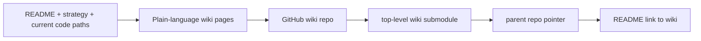

# feat: add wiki submodule and beginner-facing user guide

## Summary

Create a repo-owned GitHub wiki surface that lives as a top-level `wiki` submodule and fill it with plain-language documentation for non-technical KPatcher users. The slice must stay honest to the repo's parity-first scope, avoid copying stale technical guidance into a second unsupported manual, and isolate all work from the already-dirty `master` checkout.

---

## Problem Frame

KPatcher already has substantial repo documentation, but most of it is technical, contributor-facing, or scattered across strategy and verification documents. That is a poor entry point for players who only want to understand what the app does, how to install a mod, when to use advanced options, and what the app will not do for them. At the same time, the parent checkout already contains unrelated uncommitted changes, and the repo's GitHub wiki feature is enabled even though the expected `.wiki.git` remote is not yet reachable. This slice must therefore solve both discoverability and workflow safety.

---

## Assumptions

*This plan was authored without synchronous user confirmation. The items below are agent inferences that fill gaps in the input and should be reviewed during implementation.*

- The requested destination is the repository's GitHub wiki, not a new standalone docs repository.
- The right user audience is mod players first, with advanced CLI/validation material separated into its own page rather than mixed into the beginner path.
- Existing repo docs remain the technical source material; the wiki should summarize, translate, and deep-link instead of copying maintainer guidance wholesale.
- Because the current `master` worktree is dirty, implementation should happen in a clean feature worktree so unrelated local edits are not staged, committed, or pushed.

---

## Requirements

- R1. Add a top-level `wiki` submodule that points to the repository's own GitHub wiki and can be cloned by collaborators after the parent-repo change is pushed.
- R2. Populate the wiki with beginner-friendly documentation that explains what KPatcher does, the basic install flow, key concepts such as namespaces and logs in plain language, and the product's scope limits.
- R3. Keep the documentation honest to repo evidence: KPatcher is a parity-first installer for TSLPatcher-style KotOR mods, not a general mod manager, mod authoring suite, or promise of repo-wide parity perfection.
- R4. Separate the default beginner path from advanced or environment-specific guidance such as CLI usage, validation, uninstall, and Linux display caveats.
- R5. Make the new wiki discoverable from the parent repo without forcing end users to read deeply technical repo docs first.
- R6. Preserve user safety in git workflow: do not mix this change with the unrelated uncommitted work already present on `master`.

---

## Scope Boundaries

- No broad rewrite of existing repo documentation under `docs/`; this slice focuses on the wiki plus the smallest repo-side discoverability update needed to point users at it.
- No attempt to make stale technical docs fully current as part of this pass, except where a repo-side link would otherwise point users at obviously wrong entry guidance.
- No new application features, UI changes, or behavioral changes in KPatcher itself.
- No maintainer-facing knowledgebase expansion beyond what is needed to explain how the wiki relates to existing repo docs.
- No fake or local-only submodule state: if the wiki remote cannot be initialized and pushed successfully, do not leave the parent repo pointing at an unreachable submodule commit.

### Deferred to Follow-Up Work

- Broader cleanup of stale or contributor-only docs such as legacy quickstart/setup material.
- Richer screenshots, animated walkthroughs, or release-versioned user manuals.
- Automation for keeping repo docs and wiki pages synchronized.

---

## Context & Research

### Relevant Repo Anchors

- `README.md` describes KPatcher's parity-first intent, major components, supported workflows, vendor submodules, and current project scope.
- `STRATEGY.md` states the target problem and the product's scope limits: faithful TSLPatcher/KPatcher behavior first, cross-platform delivery second, and no reinvention into a different product category.
- `.github/copilot-instructions.md` captures architecture and user-facing workflow facts that are directly useful for end-user docs: desktop vs headless CLI modes, localized config fallback, log/progress surfaces, namespace selection, the RTF rendering caveat, and the Linux `DISPLAY=:1` requirement in cloud sessions.
- `src/KPatcher.UI/Program.cs` and `src/KPatcher.UI/KPatcherCLI.cs` define the advanced console flows that should be documented separately from the beginner path.
- `src/KPatcher.UI/ViewModels/MainWindowViewModel.cs` and related UI views describe the main desktop workflow and should anchor plain-language install guidance.

### Research Findings That Affect This Slice

- The current parent checkout is on `master` with unrelated uncommitted changes; working in place would risk mixing concerns during commit/push.
- GitHub reports `has_wiki: true` for the repository, but `git ls-remote https://github.com/th3w1zard1/KPatcher.wiki.git HEAD` currently returns `repository not found`.
- Some older repo docs appear stale relative to the current repository layout and should not be treated as canonical source material for the wiki.

### Institutional Guidance

- Repo strategy and contributor instructions consistently emphasize scope honesty and parity-first behavior over aspirational feature claims.
- Existing documentation surfaces are split by purpose; the wiki should preserve that split by serving non-technical users while leaving deeper technical policies in versioned repo docs.

---

## Key Technical Decisions

- **Use a clean feature worktree for the entire slice:** This avoids staging or committing the unrelated local edits already present on `master` and keeps the LFG pipeline shippable.
- **Bootstrap the wiki remote before recording the parent submodule pointer:** Since the repo-level wiki is enabled but the clone URL is not yet reachable, initialize the wiki content in an isolated local repo first, push it successfully, then add or normalize the parent `wiki` submodule against the now-real remote.
- **Keep the wiki information architecture compact and task-oriented:** Non-technical users need a short path, not a book. The first pass should prefer 5-7 focused pages with a clear sidebar over a large doc dump.
- **Use repo evidence, not stale docs, as the source of truth:** Where older docs conflict with current repo structure or behavior, derive the wiki wording from current README/strategy/code paths rather than mirroring legacy text.
- **Add one repo-side pointer to the wiki:** A small README update is sufficient to make the wiki discoverable without duplicating the same prose in two places.

---

## Open Questions

### Resolved During Planning

- **Should the work happen in the current checkout?** No. The dirty `master` tree makes that unsafe for an LFG commit/push/PR flow.
- **Should the wiki try to cover contributor workflows too?** No. The initial wiki should optimize for non-technical users and isolate advanced/CLI topics into a separate page.
- **Should the parent repo be updated before the wiki remote exists?** No. The parent repo should only record a submodule commit after that commit is reachable from the actual GitHub wiki remote.

### Deferred to Implementation

- **Whether GitHub accepts the initial push to the wiki remote without prior UI initialization:** verify during implementation. If GitHub rejects the push, stop and report that blocker instead of forcing a broken submodule state.
- **Whether one or two existing repo docs need tiny wording fixes in addition to the README pointer:** decide only if a broken end-user path is discovered during implementation.

---

## High-Level Technical Design

> *This diagram is directional guidance for review, not implementation specification.*

---

## Implementation Units

### U1. Isolate the work and bootstrap the wiki repository

**Goal:** Execute the slice in a clean feature worktree, create the initial wiki git history, and make the GitHub wiki remote reachable before changing the parent repo's submodule pointer.

**Requirements:** R1, R6

**Dependencies:** None

**Files:**

- Modify: `.gitmodules`
- Create/Modify: `wiki/Home.md`
- Create/Modify: `wiki/_Sidebar.md`
- Create/Modify: additional wiki pages in the `wiki/` submodule

**Approach:**

- Create a clean feature branch/worktree from `master` rather than using the already-dirty primary checkout.
- Initialize the wiki content in that clean workspace, add the GitHub wiki remote URL, and attempt the first push.
- Only after the push succeeds, record or normalize the parent repo's `wiki` submodule entry and ensure the parent repo points at the reachable wiki commit.
- If the initial push fails because GitHub still refuses the wiki repo, stop before leaving a broken parent-repo gitlink.

**Patterns to follow:**

- Existing vendor/submodule layout at the repo root.
- Existing plan discipline that avoids mixing unrelated local changes.

**Test scenarios:**

- Happy path: the wiki remote accepts the initial push, the parent repo records `wiki` as a top-level submodule, and `git submodule status` resolves cleanly.
- Edge case: the wiki remote was absent before the first push but becomes usable after initialization, with the parent submodule still pointing at the pushed commit.
- Error path: if the push is rejected or the remote remains unreachable, no parent-repo submodule pointer is committed.
- Integration: a fresh clone with submodules can initialize `wiki` from the committed parent-repo pointer.

**Verification:**

- `git -C wiki remote -v` shows the GitHub wiki remote.
- `git submodule status` in the parent repo lists `wiki` without local-only or missing-object state.

---

### U2. Author the beginner-facing wiki information architecture and content

**Goal:** Fill the wiki with clear, non-technical guidance on what KPatcher does, how the main install flow works, what users should expect from namespaces/logs, and what the app does not cover.

**Requirements:** R2, R3, R4

**Dependencies:** U1

**Files:**

- Create/Modify: `wiki/Home.md`
- Create/Modify: `wiki/_Sidebar.md`
- Create: `wiki/Installing-a-Mod.md`
- Create: `wiki/How-KPatcher-Works.md`
- Create: `wiki/What-KPatcher-Can-and-Cannot-Do.md`
- Create: `wiki/Troubleshooting.md`
- Create: `wiki/Advanced-CLI-and-Validation.md`
- Create: `wiki/FAQ.md`

**Approach:**

- Use `README.md`, `STRATEGY.md`, and current UI/CLI code paths as the authoritative sources for wording and scope.
- Keep each page focused on a user need: overview, basic install steps, plain-language explanation of namespaces/logs, limitations/scope, troubleshooting, advanced tasks, and FAQ.
- Translate technical terms into simple language without hiding important caveats such as RTF fallback behavior, Linux display caveats in cloud sessions, or the fact that the app targets TSLPatcher-style mods.
- Keep advanced CLI/validation/uninstall guidance in its own page so the beginner path stays readable.

**Patterns to follow:**

- The repo's parity-first language in `README.md` and `STRATEGY.md`.
- Current desktop and CLI behavior in `src/KPatcher.UI/Program.cs`, `src/KPatcher.UI/KPatcherCLI.cs`, and the main window/view-model flow.

**Test scenarios:**

- Happy path: the Home page gives a short explanation of KPatcher, links to the main beginner pages, and helps a new user pick the next step quickly.
- Happy path: the install guide describes the desktop workflow in a way that matches current UI behavior and terminology.
- Edge case: users who only need validation/uninstall/console help can find that guidance without reading the beginner install page.
- Edge case: limitations and non-goals are stated plainly without sounding like hidden failures or overpromises.
- Integration: the sidebar and inter-page links make the page set navigable as a coherent small manual.

**Verification:**

- The wiki pages read as a coherent beginner guide with no obvious dead ends.
- Scope statements stay aligned with repo strategy and current behavior.

---

### U3. Add parent-repo discoverability and a drift guard

**Goal:** Make the wiki easy to find from the repository and explain how it relates to the more technical repo docs.

**Requirements:** R5

**Dependencies:** U1, U2

**Files:**

- Modify: `README.md`

**Approach:**

- Add a small wiki pointer in `README.md` that directs non-technical users to the wiki and keeps the repo docs positioned as technical/contributor/reference material.
- Keep the wording short and avoid duplicating the wiki's full content in the README.
- If implementation reveals a needed freshness cue, include a brief note in the wiki Home page about using the repo docs for low-level technical details.

**Patterns to follow:**

- Existing README section structure and concise top-level documentation links.

**Test scenarios:**

- Happy path: a user landing on the repo README can immediately find the wiki.
- Edge case: the README pointer does not imply that the wiki replaces technical repo docs for contributor workflows.

**Verification:**

- The repo root has one clear pointer to the wiki and no duplicate user manual prose.

---

## System-Wide Impact

- **Git workflow:** This slice changes both parent-repo metadata and a nested wiki repo; ordering matters because the parent repo must only point at reachable wiki commits.
- **Documentation trust surface:** The wiki becomes the easiest public-facing explanation of the product, so scope honesty matters as much as completeness.
- **Discoverability:** The README-to-wiki pointer is the main bridge between the repo and the new non-technical docs surface.
- **Runtime parity risk:** None to the application itself; risk is documentation drift rather than code regression.

---

## Risks & Dependencies

| Risk | Mitigation |
|------|------------|
| GitHub wiki remote still rejects the first push even though `has_wiki` is enabled | Treat wiki bootstrap as a hard gate; do not commit a broken parent submodule pointer |
| Wiki wording drifts from actual UI/CLI behavior | Source all user-facing statements from current README, strategy, and active code paths rather than stale setup docs |
| The wiki becomes a second sprawling technical manual | Keep the first pass to a compact task-oriented page set and point advanced readers back to repo docs for deep details |
| Dirty local `master` changes leak into the LFG branch or PR | Perform all execution in a clean feature worktree and stage only files belonging to this slice |

---

## Documentation / Operational Notes

- Prefer plain language and concrete user tasks over implementation terms when a simpler phrasing is accurate.
- Call out product limits directly: KPatcher is for TSLPatcher-style mod installs, not every possible KotOR mod workflow.
- Avoid using the existing legacy quickstart/setup docs as the primary source for wiki wording unless specific claims are re-verified against the current repo.

---

## Sources & References

- `README.md`
- `STRATEGY.md`
- `.github/copilot-instructions.md`
- `src/KPatcher.UI/Program.cs`
- `src/KPatcher.UI/KPatcherCLI.cs`
- `src/KPatcher.UI/ViewModels/MainWindowViewModel.cs`
